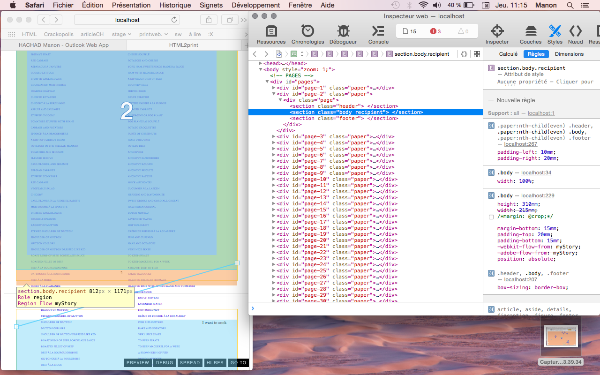
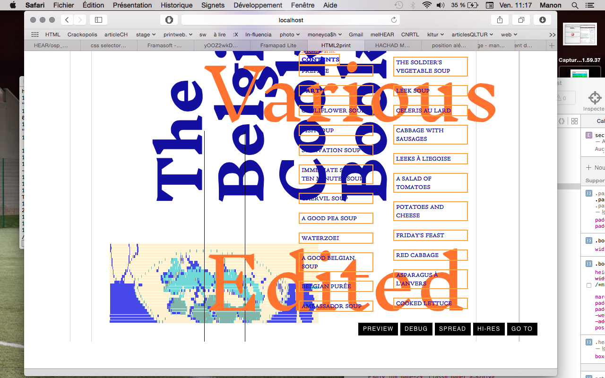

# HTML_sauce-cocktail-workshop-OSP

Explorations des possibilités HTML2print durant une semaine de workshop
10 au 13 mars 2015

## à propos d'HTML 2 print

<https://github.com/osp/osp.tools.html2print>

This little tool is a boilerplate, a minimal example to start a print project
using HTML, less/CSS and Javascript/Jquery to design it.  

### Why use html to make printed matters?

The most exciting reason to use HTML/CSS is the fact that you can go back
and forth between code and visual manipulation thanks to the element inspector
of browsers. With Javascript on top of it, you can access every object in the
DOM and its properties or do programmatic manipulations. This back-and-forth
between hand and code manipulations is new to print production.

The second strong reason why we set this up is that because the design is made
with code/text, it means we can use collaborative text editors such as
Etherpad to design with several people at the same time.

### Why use this instead of libraries such as the PHP library tcpdf which transforms html to a PDF for print?

Because CSS specifications for print are all settled, we are just waiting for
browsers vendors to implement them *well*. Meanwhile, it's already
possible to send to an offset printer a file generated from a webpage. So why
use a third party engine if you want to print HTML?

